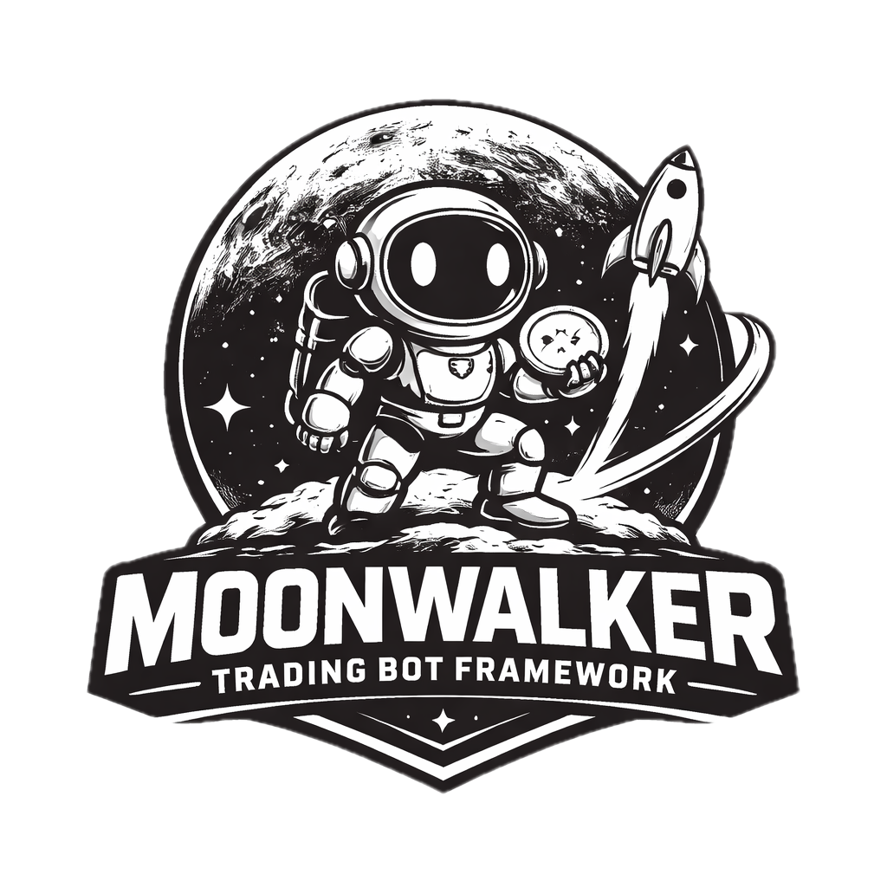

# Moonwalker

<p align="center">
  
</p>

## Summary
Moonwalker is a self-hosted cryptocurrency trading bot with a Litestar backend,
Vue dashboard, exchange integration via CCXT/CCXT Pro, and support for both
signal-driven entries and dynamic DCA management. It also includes an
Autopilot Memory cockpit that surfaces favored and cooling symbols, suggested
base orders, and plain-language trust signals in the Control Center.

## Disclaimer
**Moonwalker is meant to be used for educational purposes only. Use with real funds at your own risk**

## Deployment Model
- Moonwalker is designed to run as a **single-node, single-instance** app.
- One instance owns its own DB, configuration, watcher/runtime state, and
  trading engine.
- It is normal to have **multiple dashboard clients** connected to the same
  instance at the same time.
- Separate Moonwalker installs are intentionally isolated from each other.

## Prerequisites
- Python >= 3.11
- Node.js (for the frontend build)
- TA-Lib installed for your OS
- Configured API access on your exchange

Linux is the most typical deployment target, but any environment that supports
Python, Node.js, and TA-Lib can work.

### Run Script (Recommended)
1. Start everything with `./run.sh start -p "port"`.
   - Debug logs: `./run.sh start --debug`
   - Trace logs: `./run.sh start --trace`
2. Stop with `./run.sh stop`.

The script builds the Vue frontend, copies assets into the backend, creates a
Python venv, installs backend deps, and starts the Litestar app in the
background. Logs go to `run.log`.

By default the app listens on port `8130`. The backend runtime is intentionally
single-process because the trading engine uses shared in-memory runtime state.

### Full Verification
Run the full backend and frontend verification suite with:

```bash
cd scripts && ./ci.sh
```

### TA-Lib dependency
You also need to install the ta-lib library for your OS. Please see: https://ta-lib.org/install/#linux-debian-packages

## Documentation
- Documentation index: `docs/README.md`
- Release notes: `CHANGELOG.md`
- Current tracked release version: `VERSION`
- Configuration and full key reference: `docs/configuration.md`
- API and websocket reference: `docs/api.md`
- Monitoring (Telegram): `docs/monitoring.md`
- Dynamic SO details and formulas: `docs/dynamic-so.md`
- Signal plugin setup (SymSignals, ASAP, CSV): `docs/signals.md`
- CI, runtime operations, backups, logs, and dashboard streams:
  `docs/operations.md`
